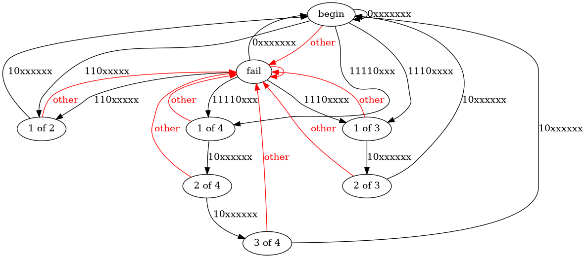

# Daily Coding Problem: Problem #965 [Easy] 

This problem was asked by Google.

UTF-8 is a character encoding that maps each symbol to one, two, three, or four bytes.

For example, the Euro sign, €,
corresponds to the three bytes 11100010 10000010 10101100.
The rules for mapping characters are as follows:

* For a single-byte character, the first bit must be zero.
* For an n-byte character, the first byte starts with n ones and a zero.

The other n - 1 bytes all start with 10.

Visually, this can be represented as follows.

```
 Bytes   |           Byte format
-----------------------------------------------
   1     | 0xxxxxxx
   2     | 110xxxxx 10xxxxxx
   3     | 1110xxxx 10xxxxxx 10xxxxxx
   4     | 11110xxx 10xxxxxx 10xxxxxx 10xxxxxx
```

Write a program that takes in an array of integers representing byte values,
and returns whether it is a valid UTF-8 encoding.

## Analysis

I chose to use a state machine:



I chose to use a `Fail` state separate from `Begin`
to allow my program to re-synchronize if bad byte(s) appear in
its input.

[My program](r1.go) also prints out code points as it finds them.

```sh
$ go build r1.go
$ go build mkunicode.go
$ ./mkunicode 2 | ./r1   # can use 0 - 5
```

It's possible to do something other than a state machine and satisfy the
problem statement.
A program could just check byte prefixes, and ensure that "subsequent bytes"
(10xxxxxx pattern bytes) appear in the proper number.
Such a program can return false at the first incorrect byte prefix.

## Interview Analysis

The problem statement doesn't cover the whole of UTF-8:
a program can re-synchronize with a UTF-8 bytestream after encountering
a goofed up code point.
A single bad byte or even a stream of them doesn't keep a program
like `xterm` from rendering the rest of the stream of bytes.
The problem statement doesn't ask for what valid Unicode code points exist.

I'm not sure this is a great interview problem in general:
unless the candidate knows a fair amount about UTF-8,
the interviewer is probably going to get a byte-prefix-checker.
That's quite a clumsy program,
although the interviewer might get to see heroic struggles.

The state machine implementation,
while easy to reason about,
is also not an "easy" programming task.
This probably deserves a "medium" rating.

Test cases don't suggest themselves based on the problem statement,
which doesn't include synchronizing after a bad byte,
and there are several cases to check there.
The candidate should suggest a valid UTF-8 byte stream with 1, 2, 3 and 4-byte
UTF-8 encodings,
and some invalid byte streams,
where the invalid byte occurs after a "110xxxxx", "110xxxx" and a "11110xxx" byte,
and also a stream with an invalid byte futher out in the "subsequent byte" positions.
